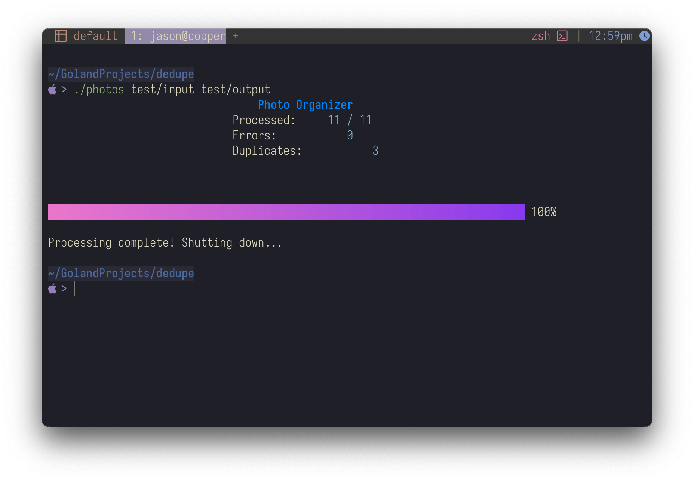

# Dedupe - Photo and Video Organizer

**Dedupe** is a command-line tool designed to organize and deduplicate large photo and video collections, with a real-time Terminal User Interface (TUI). This project was created to fulfill two objectives:
1. **Clean Up Personal Photo/Video Archives**: Organize a 20+ year collection spanning over 122,000 files into a structured and easy-to-navigate format.
2. **Go & TUI Refresh**: Learn modern Go programming practices and explore the Charm TUI libraries (`bubbletea`, `bubbles`, and `lipgloss`).

---

## What I Set Out to Do

- Build a fast and efficient tool to process thousands of files and organize them by creation date.
- Deduplicate files based on their content using MD5 hashes to ensure no duplicates clutter the archive.
- Include video file support by extracting metadata like creation date from video files using tools such as `yami`.
- Learn and implement an interactive TUI to display real-time progress and stay informed about the process statistics.

---

## What I Learned

- **Charm TUI Libraries**: Gained experience with the `bubbletea`, `bubbles`, and `lipgloss` libraries to build a multi-component, real-time, interactive Terminal interface.
- **Video Metadata Parsing**: Integrated `github.com/cajax/yami` for handling video metadata extraction, ensuring compatibility with various video formats.
- **File Metadata & Organization**: Refreshed knowledge of working with files, EXIF metadata for photos, and OS-level file operations in Go.
- **Efficient Concurrency**: Leveraged Go routines and the `sync` package to create an efficient worker pool, processing files in parallel on multicore CPUs.
- **Cross-Platform Insights**: Validated the tool across macOS, Linux, and Windows, learning platform-specific caveats (like handling hidden files).

---

## Features

- **Organize by Creation Date**: Automatically sort files into `year/month/day` folders using their metadata.
- **Duplication Detection**: Identify duplicate files with MD5 checksum comparisons, and move duplicates into a separate folder.
- **Support for Photos and Videos**: Extract metadata from EXIF headers for photos and video metadata for videos.
- **Intuitive Terminal UI**: Real-time progress updates, stats, and feedback via an interactive Terminal UI built with `bubbletea`.
- **Cross-Platform Compatibility**: Works on Windows, macOS, and Linux.

---

## Installation

### Prerequisites

- **Go** 1.24 or later must be installed on your system.

### Build From Source

1. Clone the project repository:
   ```sh
   git clone https://github.com/yourusername/dedupe.git
   cd dedupe
   ```

2. Build the application:
   ```sh
   go build
   ```

---

## Interactive TUI

### Real-Time Progress UI

While Dedupe is processing, you will see an interactive Terminal UI that provides:
- Files processed count.
- Duplicate files detected.
- Errors and statistics updates.



### Controls

- **`q`** or **`Ctrl+C`**: Quit the application at any time.

---

## Logs

- All identified duplicates are logged in a `duplicates.log` file located in the current working directory.

---

## Dependencies

Here’s what powers Dedupe:
- 💾 **[github.com/cajax/yami](https://github.com/cajax/yami)**: Extract metadata from video files.
- 🌅 **[github.com/rwcarlsen/goexif](https://github.com/rwcarlsen/goexif)**: Retrieve EXIF metadata from photos.
- 💻 **[github.com/charmbracelet/bubbletea](https://github.com/charmbracelet/bubbletea)**: Terminal User Interface (TUI) framework.
- 🎨 **[github.com/charmbracelet/lipgloss](https://github.com/charmbracelet/lipgloss)**: For styled Terminal outputs.
- 🎛️ **[github.com/charmbracelet/bubbles](https://github.com/charmbracelet/bubbles)**: Ready-made TUI components for managing interactive states.

---

## Future Improvements (Ideas for Expansion)

Here are some ideas that might make Dedupe even better:
- Support for additional file formats like `.heic` (common in iPhones).
- Generate a summary report (e.g., JSON or HTML) for processed files.
- Implement more advanced TUI features, like input and output directory selection, full-screen output, and more detailed realtime statistics.
- Advanced duplicate detection using perceptual hashing for similar images.
- Optional cloud backup integration after organizing files.

--- 

## Usage

```shell
 sh ./dedupe <source-dir> <dest-dir>
```


### Arguments

- `<source-dir>`: Directory containing your photos and videos to be organized.
- `<dest-dir>`: Directory where the organized files will be placed.

### Example

```shell
 sh ./dedupe ~/Pictures/Unsorted ~/Pictures/Organized
```

### Output Directory Structure

Once processing is complete, your destination directory (`dest-dir`) will be organized as follows:
```shell
 dest-dir/
 ├── YYYY/
 │    │
 │    └── MM/
 │         │
 │         └── DD/
 │              │
 │              └── filename_checksum.ext
 ├── duplicates/
 │     └── file_duplicate.ext
 └── nodata/
       └── files_without_date_metadata.ext
```

- Files with valid creation date metadata are organized into directories by year, month, and day.
- **Duplicate files** are stored in the `duplicates` directory with the original name and structure preserved.
- **Files without metadata** are placed in the `nodata` directory.
- If **duplicates** are found in the `nodata` or `duplicates` directories, they will be stored with a numerical extension (e.g., `file_duplicate_1.ext`, `file_duplicate_2.ext`).

---

## License

This project is licensed under the [MIT License](LICENSE).

---