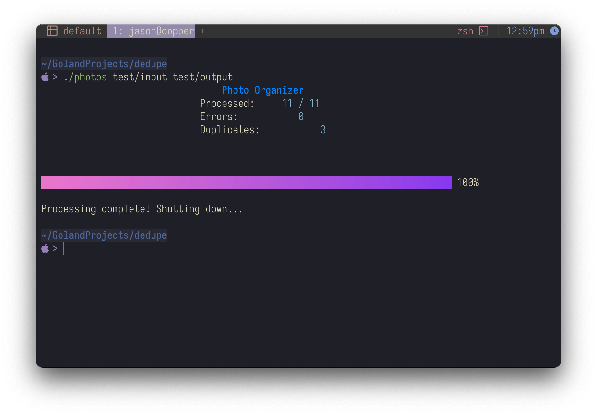

# dedupe - Photo and Video Organizer

**dedupe** is a command-line tool for organizing and deduplicating large photo and video collections. It provides three subcommands that cover the full workflow: organize files by date, visually review duplicate pairs in a browser, and execute the recorded decisions.

This project was created to fulfill two objectives:
1. **Clean Up Personal Photo/Video Archives**: Organize a 20+ year collection spanning over 122,000 files into a structured and easy-to-navigate format.
2. **Go Refresh**: Learn modern Go programming practices and explore the Charm TUI libraries (`bubbletea`, `bubbles`, and `lipgloss`).

---

## Workflow Overview

```
dedupe organize  -->  dedupe review  -->  dedupe clean
   (sort files)       (pick keepers)      (apply decisions)
```

---

## What I Set Out to Do

- Build a fast and efficient tool to process thousands of files and organize them by creation date.
- Deduplicate files based on their content using MD5 hashes to ensure no duplicates clutter the archive.
- Include video file support by extracting metadata like creation date from video files using tools such as `yami`.
- Learn and implement an interactive TUI to display real-time progress and stay informed about the process statistics.
- Add a browser-based review UI for making keep/delete decisions on duplicate pairs before any files are removed.

---

## What I Learned

- **Charm TUI Libraries**: Gained experience with the `bubbletea`, `bubbles`, and `lipgloss` libraries to build a multi-component, real-time, interactive terminal interface.
- **Video Metadata Parsing**: Integrated `github.com/cajax/yami` for handling video metadata extraction, ensuring compatibility with various video formats.
- **File Metadata and Organization**: Refreshed knowledge of working with files, EXIF metadata for photos, and OS-level file operations in Go.
- **Efficient Concurrency**: Leveraged goroutines and the `sync` package to create an efficient worker pool, processing files in parallel on multicore CPUs.
- **Embedded HTTP Server**: Built a small `net/http` server with a single embedded HTML file (vanilla JS, no build step) for the review UI.

---

## Features

- **Organize by Creation Date**: Automatically sort files into `year/month/day` folders using their EXIF or video metadata.
- **Duplication Detection**: Identify duplicate files with MD5 checksum comparisons.
- **Support for Photos and Videos**: Extract metadata from EXIF headers for photos and video metadata for videos.
- **Interactive Terminal UI**: Real-time progress updates, stats, and feedback via a TUI built with `bubbletea`.
- **Browser-Based Review**: Side-by-side visual review of duplicate pairs with keyboard shortcuts and per-session persistence.
- **Safe Cleanup**: Dry-run by default; requires `--execute` to actually delete or move files.
- **Copy or Move**: Preserves originals by default during organization; use `--move` to move instead.

---

## Installation

### Prerequisites

- **Go** 1.24 or later

### Build From Source

```sh
git clone https://github.com/shurikai/dedupe.git
cd dedupe
go build
```

---

## Usage

```
dedupe <subcommand> [flags] [arguments]
```

Run `dedupe --help` or `dedupe <subcommand> --help` for flag details.

---

### `organize` - Sort and deduplicate files

Walks a source directory, extracts creation dates, and copies (or moves) files into a `year/month/day` hierarchy in the destination directory. Files without date metadata go into `nodata/`; duplicates (detected by MD5) go into `duplicates/`.

```sh
dedupe organize [--move] [--log <file>] <source-dir> <dest-dir>
```

| Flag | Default | Description |
|---|---|---|
| `--move` | false | Move files instead of copying |
| `--log <file>` | `duplicates.log` | Path for the duplicate log file |

**Example:**

```sh
dedupe organize --move --log my.log ~/Pictures/Unsorted ~/Pictures/Organized
```

**Output directory structure:**

```
dest-dir/
├── 2023/
│   └── 08/
│       └── 14/
│           └── filename_a1b2c3d4.jpg
├── duplicates/
│   └── filename_duplicate.jpg
└── nodata/
    └── filename_no_exif.jpg
```

A real-time TUI tracks progress while the command runs. Press `q` or `Ctrl+C` to quit.



---

### `review` - Visually review duplicate pairs

Starts a local web server and opens a browser UI for reviewing pairs of files side-by-side. Decisions are written to a JSON sidecar file as you go, so you can stop and resume at any time.

**Input:** a plain text file where each line contains two file paths separated by whitespace.

```
/photos/2023/img_001.jpg  /photos/backup/img_001.jpg
/photos/2023/vid_042.mp4  /photos/backup/vid_042.mp4
```

```sh
dedupe review [--port <n>] [--output <file>] <pairs-file>
```

| Flag | Default | Description |
|---|---|---|
| `--port <n>` | `8080` | Port for the local server |
| `--output <file>` | `<pairs-file>.decisions.json` | Path for the decisions output file |

**Example:**

```sh
dedupe review --port 9000 ~/Pictures/duplicates.txt
```

The browser opens automatically. If it cannot, the URL is printed. Press `Ctrl+C` to stop the server.

**Keyboard shortcuts:**

| Key | Action |
|---|---|
| `d` | Delete right, keep left (left is canonical) |
| `D` | Delete left, keep right (right is canonical) |
| `k` | Keep both |
| `u` | Unsure / skip |
| `n` or `→` | Next pair |
| `p` or `←` | Previous pair |

The dot strip at the top shows the review status of every pair at a glance. The UI auto-advances to the next unreviewed pair after each decision.

#### Decisions file format

The `review` command writes a JSON sidecar file (e.g. `duplicates.decisions.json`) that `clean` reads later:

```json
[
  {
    "left": "/photos/2023/img_001.jpg",
    "right": "/photos/backup/img_001.jpg",
    "decision": "delete_right"
  },
  {
    "left": "/photos/2023/vid_042.mp4",
    "right": "/photos/backup/vid_042.mp4",
    "decision": "unsure"
  }
]
```

Valid decision values: `delete_left`, `delete_right`, `keep_both`, `unsure`, `""` (empty = not yet reviewed).

#### Review server API

The server exposes four endpoints. All file-serving requests are validated against the loaded pair list; arbitrary filesystem access is not permitted.

| Method | Path | Description |
|---|---|---|
| `GET` | `/` | Serves the review UI (embedded HTML) |
| `GET` | `/api/pairs` | Returns the full pair list with decisions |
| `POST` | `/api/decision` | Records a decision for one pair |
| `GET` | `/api/file?path=<abs-path>` | Serves a file from the pair list |

**`GET /api/pairs`** - Response body (JSON array of pair objects):

```json
[
  {
    "index": 0,
    "left": "/photos/2023/img_001.jpg",
    "right": "/photos/backup/img_001.jpg",
    "decision": "delete_right"
  }
]
```

**`POST /api/decision`** - Request body:

```json
{ "index": 0, "decision": "delete_right" }
```

Returns `204 No Content` on success. Valid decision values match those listed above.

**`GET /api/file?path=/absolute/path/to/file.jpg`** - Serves the file as a static asset. Returns `403 Forbidden` if the path is not in the loaded pair list.

---

### `clean` - Apply recorded decisions

Reads a decisions file produced by `review` and deletes or moves the marked files.

**Dry-run is the default.** Pass `--execute` to actually perform any file operations.

```sh
dedupe clean [--execute] [--dry-run] [--move-to <dir>] [--yes] <decisions-file>
```

| Flag | Default | Description |
|---|---|---|
| `--execute` | false | Actually perform file operations |
| `--dry-run` | false | Explicit dry-run (overrides `--execute` if both are passed) |
| `--move-to <dir>` | | Move marked files here instead of deleting |
| `--yes` | false | Skip the confirmation prompt |

**Example - preview what would happen:**

```sh
dedupe clean ~/Pictures/duplicates.decisions.json
```

**Example - delete for real:**

```sh
dedupe clean --execute ~/Pictures/duplicates.decisions.json
```

**Example - move to a staging directory instead of deleting:**

```sh
dedupe clean --execute --move-to ~/Pictures/Staging ~/Pictures/duplicates.decisions.json
```

Before executing, the command prints a summary and asks for confirmation:

```
3 file(s) will be deleted. 5 pair(s) kept. 2 unsure.

Files to delete:
  /photos/backup/img_001.jpg
  /photos/backup/img_002.jpg
  /photos/backup/vid_042.mp4

Proceed? This will delete 3 file(s). [y/N]
```

Unsure and unreviewed pairs are listed but never acted on.

---

## Logs

Duplicate files detected during `organize` are logged to `duplicates.log` (configurable with `--log`).

---

## Dependencies

- **[github.com/spf13/cobra](https://github.com/spf13/cobra)**: CLI subcommand framework.
- **[github.com/cajax/yami](https://github.com/cajax/yami)**: Video metadata extraction.
- **[github.com/rwcarlsen/goexif](https://github.com/rwcarlsen/goexif)**: EXIF metadata for photos.
- **[github.com/charmbracelet/bubbletea](https://github.com/charmbracelet/bubbletea)**: Terminal UI framework.
- **[github.com/charmbracelet/lipgloss](https://github.com/charmbracelet/lipgloss)**: Styled terminal output.
- **[github.com/charmbracelet/bubbles](https://github.com/charmbracelet/bubbles)**: TUI components.

---

## Future Improvements

- Advanced duplicate detection using perceptual hashing for visually similar images (not just exact MD5 matches).
- Full-screen TUI with directory selection and richer real-time statistics for the `organize` command.
- Optional cloud backup integration after organizing files.

---

## License

This project is licensed under the [MIT License](LICENSE).
